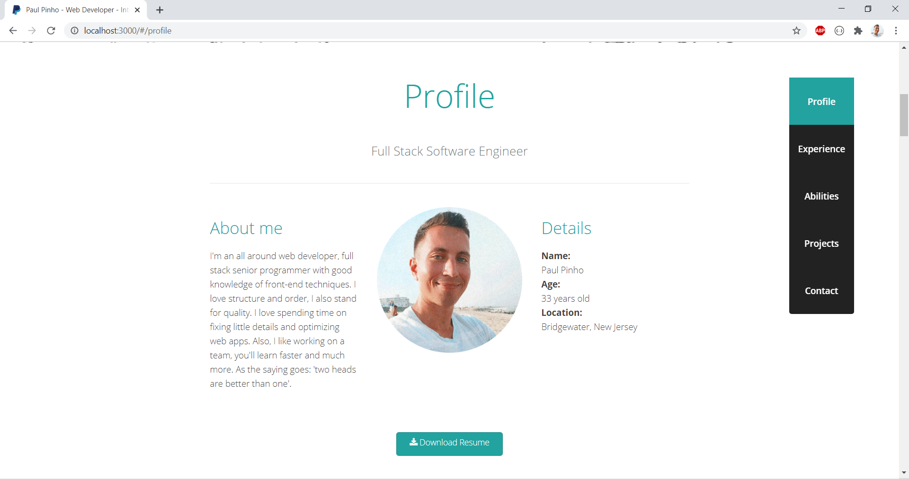
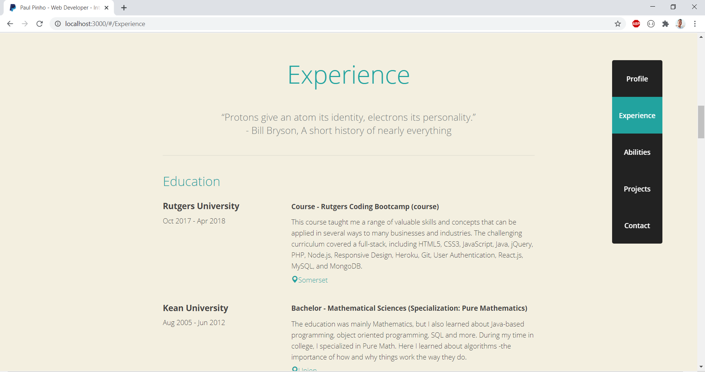
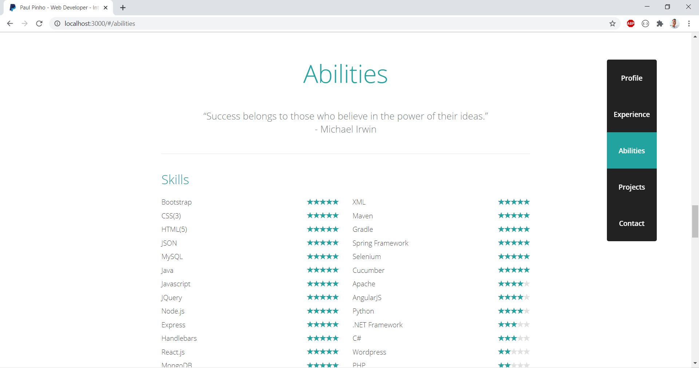
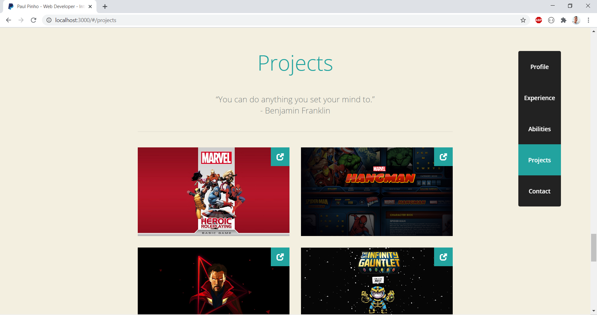
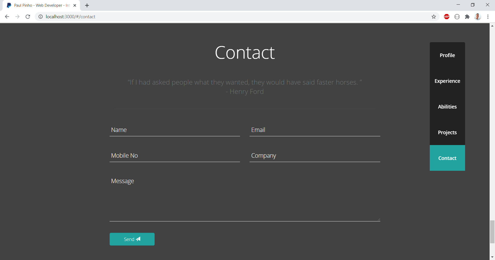

# Interactive-Resume
This is my main portfolio site at the moment. It was made with HTML, CSS, jQuery, PHP, and Bootstrap.

* The first thing the user will notice is the header I created with Spier-man in the background and a logo of my name I made with Google Fonts.

* Next the user will see the Profile section of the site. It features an image and a brief description about myself as well as a link to view and print a traditional paper resume in pdf format.

* The Experience displays past/present employment and education. On a laptop or desktop computer the background of this section is parrallax, while it is static on mobile.

* The Skills section is next to display some of the coding languages, skills and tools I am proficient in. On a laptop or desktop computer the background of this section is parrallax, while it is static on mobile.

* Next is the Projects section I made as a place where I can display some of my recent projects. The user can open up a demo of the project or it's Github page to view the code.

* FInally at the bottom of the page is a Contact form where the user can send a message to my email. Underneath the form there are links to all of my Social Media accounts.

### Technologies used

- Node.js
- React

### Built With

* Intellij - Text Editor

### Copyright

Paul Pinho © 2018. All Rights Reserved.